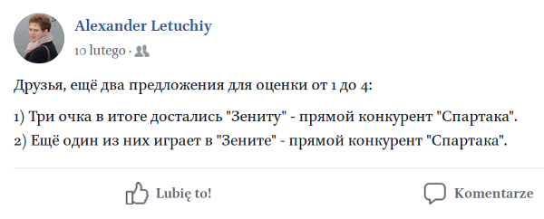

```{r setup, include=FALSE}
knitr::opts_chunk$set(echo = FALSE, message = FALSE, error = FALSE, warning = FALSE, fig.width = 7)
library(tidyverse)
library(Compositional)
library(mosaic)
```

## Исследования грамматичности

Исследование грамматичности --- является центральным хотя и не единственным источником данных в лингвистике (ср. с корпусными, психолингвистическими и нейролингвистическими исследованиями). Лингвисты разработали достаточно большой арсенал экспериментов, позволяющих исследовать грамматичность, которые в основном различаются типом ответов, получаемым от участников:

* бинарная классификация языкового примера
* оценка языкового примера с использованием некоторой дискретной шкалы (шкалы Лайкерта, [@likert1932])
* оценка языкового примера с использованием некоторой непрерывной шкалы (Magnitude estimation, [@bard1996])
* сравнение двух языковых примеров (минимальные пары)

## Исследования грамматичности

Идея, являющаяся ядром всех экспериментов на грамматичность, описана еще в работе [@galton1907]. В большинстве работ смотрят, что влияет на исседования грамматичности [@dabrowska10, @miller09, @featherston08, @haussler17, @juzek16]. Также интерес представляет работа [@langsford2018], посвященная сравнению результатов, полученных разными методами.


## Однако на практике…

>- 
>- экспедиционная элицитация  <audio controls>
  <source src="https://raw.githubusercontent.com/agricolamz/2018.04.21_MSU_acceptability/master/02_elicitation.mp3" type="audio/mp3">
</audio>
>- дополнительные параметры (такие как пол, возраст, усталость информанта и т.п.) просто игнорируются
>- необходимо делать сходные выводы о грамматичности предложения исходя из разных тестов
>- необходимо инкорпорировать дополнительные параметры в модель

## Грамматичность

> * Предположим, что грамматичность предложения --- это некоторое значение от 0 (неграмматичное) до 1 (грамматичное).
> * Тогда в зависимости от типа эксперимента мы можем моделировать грамматичность (p(+) и p(∗))

## Грамматичность: "можно сказать" и "нельзя сказать"

Представим себе обычную элицитацию, где k (27) из n (83) носителей признали предложение грамматичным.

> * Фриквентистский подход: биномиальный тест
> * Хакерский подход: симуляция
> * Байесовский подход: корректировка априорного бета распределение при помощи данных

## Грамматичность: "можно сказать" и "нельзя сказать"

Фриквентистский подход: биномиальный тест

```{r}
data_frame(id = 1:83,
           density = dbinom(x = 1:83, size = 83, prob = 0.23)) %>% 
  ggplot(aes(id, density))+
  geom_line()+
  geom_area(aes(x = ifelse(id>=qbinom(0.025, 83, 0.23) &
                           id<=qbinom(0.975, 83, 0.23), id, NA)),
            fill = "lightblue")+
  geom_vline(xintercept = 27, linetype = 2)+
  scale_x_continuous(breaks = c(0, 12, 19, 27, 2:4*20))+
  theme_bw()+
  labs(title = "Биномиальное распределение с параметрами n = 83, p = 0.23",
       subtitle = "Голубой — центральные 95% данных")
binom.test(x = 27, n = 83, p = 0.23)
```

## Грамматичность: "можно сказать" и "нельзя сказать"

Хакерский подход: симуляция

```{r}
set.seed(42)
do(1000)*
  sum(sample(x = 1:0, 
             size = 83, 
             prob = c(0.23, 0.77), 
             replace = TRUE)) ->
  simulations
simulations %>% 
  ggplot(aes(sum))+
  geom_density(fill = "lightblue")+
  geom_vline(xintercept = 27, linetype = 2)+
  theme_bw()+
  labs(title = "Распределение 1000 симуляций с параметрами n = 83, p = 0.23")
simulations %>% 
  mutate(greater = sum >= 27) %>% 
  count(greater)
```

## Грамматичность: "можно сказать" и "нельзя сказать"

Байесовский подход: корректировка бета распределения.

$$f(x; α, β) = \frac{x^{α-1}\times (1-x)^{β-1}}{B(α, β)}; 0 \leq x \leq 1; α, β > 0$$ 
Бета функция: $$Β(α, β) = \frac{Γ(α)\times Γ(β)}{Γ(α+β)} = \frac{(α-1)!(β-1)!}{(α+β-1)!} $$

```{r}
x <- seq(0, 1, length = 100)
alpha <- c(23, 33, 69)
beta <- 83-alpha
density <- c(dbeta(x, shape1 = alpha[1], shape2 = beta[1]),
             dbeta(x, shape1 = alpha[2], shape2 = beta[2]),
             dbeta(x, shape1 = alpha[3], shape2 = beta[3]))
params <- rep(paste("α =", alpha, ", β =", beta), each = 100)
betas <- data_frame(density, params, id = rep(x, 3))

betas %>% 
  ggplot(aes(id, density, fill = params))+
  geom_polygon(alpha = 0.8)+
  labs(title = "PDF для трех бета распределений")+
  theme_bw()
```

$$Ε[X] = \frac{α}{α+β}; D[X] = \frac{α\times β}{(α+β)^2(α+β+1)}$$

... а тут надо бы разораться с байесовской статистикой...

## Грамматичность: "можно сказать" и "нельзя сказать"

Shiny (пакет на языке R) приложение для сегодняшнего доклада:
```{r, eval=FALSE, echo= TRUE}
shiny::runGitHub("agricolamz/2018_18.04.28_Grammaticality_shiny")
```

## Вариативность

Перед этим мы считали, что ответы носителей бывают двух типов. Но это же неправда!

* "можно так, а можно так..."
* "я так не говорю, но от других слышал(а)"
* носитель может не осознавать свою вариативность...

Обозначим все эти ситуации как  p(?)

## Ограничения на p(?)

* для значения грамматичности 1 распределение вероятностей должно быть:
      * $p(∗) = 0,\ p(?) = 0,\ p(+) = 1$
* для значения грамматичности 0 распределение вероятностей должно быть:
      * $p(∗) = 1,\ p(?) = 0,\ p(+) = 0$
* для значения грамматичности 0.5 все ответы должны быть равновероятны:
      * $p(∗) = \frac{1}{3},\ p(?) = \frac{1}{3},\ p(+) = \frac{1}{3}$
      
```{r,  fig.height=3}
data_frame(grammaticality = c(0, 0.5, 1),
           `p(+)` = c(0, 0.3, 1),
           `p(∗)` = c(1, 0.3, 0),
           `p(?)` = c(0, 0.3, 0)) %>%
  gather(type, probability, `p(+)`:`p(?)`) %>% 
  mutate(type = factor(type, levels = c("p(∗)", "p(?)", "p(+)"))) %>% 
  ggplot(aes(grammaticality, probability))+
  geom_point()+
  geom_line(linetype = 2, size = 0.3)+
  facet_wrap(~type)+
  theme_bw()
```

## Распределение Дирихле
Бета распределение: 
$$Β(α, β) = \frac{Γ(α)\times Γ(β)}{Γ(α+β)} = \frac{(α-1)!(β-1)!}{(α+β-1)!} $$

Распределение Дирихле
$$Dir(α_1, α_2, …, α_k) = \frac{1}{B(α_1, α_2, …, α_k)}\prod_{i = 1}^{k}x_i^{\alpha_i-1}, где B(α) = $$

```{r}
diri.contour(a = c(5, 12, 3))
title(xlab="grammaticality",
      main=paste0("α_1 = ", 5, 
                  ", α_2 = ", 12, 
                  ", α_3 = ", 5))
```

## Грамматичность: учитывая вариативность

Shiny (пакет на языке R) приложение для сегодняшнего доклада:
```{r, eval=FALSE, echo= TRUE}
shiny::runGitHub("agricolamz/2018_18.04.28_Grammaticality_shiny")
```

## Как же нам получить соответствующее распределение Дирихле?

* Функция правдоподобия и куча других методов

→ можно использовать фриквентистки, оценивая доверительные интервалы и т. п.

→ можно использовать хакерски, симулируя фриквентисткий подход

→ можно использовать байесовски, имея некоторые априорные вероятности

## Заключение

* грамматичность можно оценивать на шкале отличной от бинарный грамматичный vs. неграмматичный
* используя бета распределения и распределения дирихле, мы можем сравнивать грамматичность разных предложений, и визуализировать степень доверия к разным данным
* больше носителей, больше примеров, подтверждающих какое-то явление…

Презентация доступна здесь: https://goo.gl/CMbjA2

Приложение доступно здесь: https://goo.gl/pqhMgk

Пишите мне: agricolamz@gmail.com

## Referenses {.smaller}